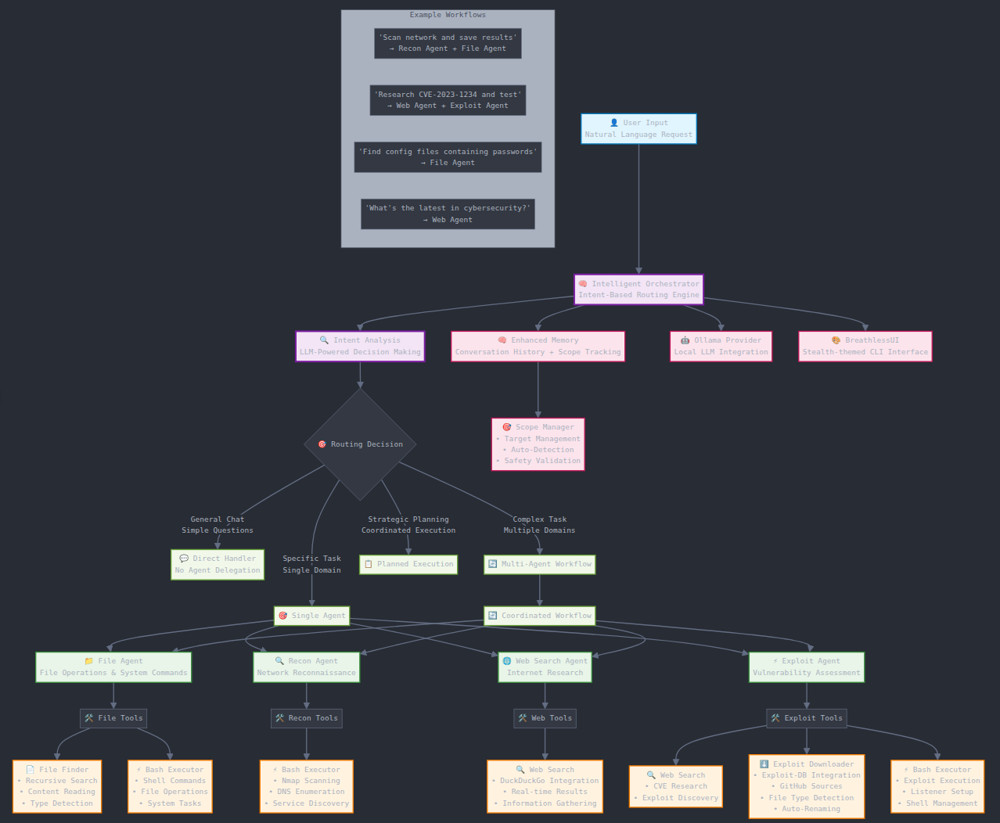

# BreathlessSymphony v2.1.2
An Autonomous Agentic Framework with Intent-Based Routing.



## Features

*   **Intelligent Intent-Based Routing (v2.0)**: Automatically analyzes user requests and delegates tasks to the most suitable specialized agent or combination of agents.
*   **Specialized Agents**:
    *   **FileAgent**: Manages local file operations, executes bash commands, and handles system tasks.
    *   **ReconAgent**: Performs network reconnaissance, security scanning, and target analysis.
    *   **WebSearchAgent**: Conducts internet research, gathers information online, and fetches current data.
    *   **ExploitAgent**: Handles vulnerability assessment, including CVE research, exploit discovery, download, and preparation.
*   **Multi-Agent Coordination**: Capable of orchestrating complex workflows by combining the strengths of multiple agents.
*   **Ollama Integration**: Leverages Ollama ease-of-use with local models, ensuring privacy and negating dependency on external services.
*   **Interactive Command-Line Interface (CLI)**: Offers a user-friendly CLI with rich, colored output, status updates, and easy interaction.
*   **Scope Management (v1.5)**: Allows users to define and manage a penetration testing scope (targets, networks) for focused operations.
*   **Configuration Management**: Uses `config.ini` for managing project settings, with sensible defaults provided in `config.py`.
*   **Directory Structure Management**: Automatically creates necessary directories for agent and framework organization.
*   **Prompt Management**: Easily configure and modify each agent's system prompt(s).

## Getting Started

To get started with BreathlessSymphony:

1.  **Ensure Ollama is Running**:
    Open a terminal and start the Ollama service:
    ```bash
    ollama serve
    ```
    Alternatively, allow Ollama to run in the background. This framework will handle the connection.

2.  **Pull an Ollama Model**:
    You need a model compatible with Ollama. It must support function calling. Default model is `gemma3:27b` (configurable in `config.ini`). Pull it using:
    ```bash
    ollama pull gemma3:27b
    ```
    (Replace `gemma3:27b` if you've configured a different model).

3.  **Install Dependencies**:
    Navigate to the project directory, set up a virtual environment, and install the required Python packages:
    ```bash
    python -m venv venv
    source venv/bin/activate
    pip install -r requirements.txt
    ```

4.  **Run the Application**:
    Execute the main script:
    ```bash
    python main.py
    ```
    On the first run, if `config.ini` doesn't exist, it will be created with default settings. You can customize these settings later.

## Configuration

The project uses a `config.ini` file to manage configurations. If the file doesn't exist, it will be created with default settings. Key configurations include:

*   `provider_name`: The AI provider (default: `ollama`).
*   `provider_model`: The specific model to use (default: `gemma3:27b`).
*   `provider_server_address`: The address of the provider server (default: `127.0.0.1:11434`).
*   `agent_name`: The name of the assistant (default: `Assistant`).
*   `work_dir`: The working directory for the agent (default: `~/agentic_workspace`).
*   `verbose`: Enable or disable verbose logging (default: `False`).

## Usage

BreathlessSymphony is designed for intuitive interaction through its command-line interface. You interact with the main orchestrator, which then intelligently routes your requests to the appropriate specialized agent(s) and reports back to you.

### Interacting with Agents

Simply type your request in natural language. The system will analyze your intent and delegate the task.

**Examples:**

*   **General Conversation** (handled directly by the orchestrator):
    *   `How are you doing today?`
    *   `What can you help me with?`

*   **Web Research** (delegated to `WebSearchAgent`):
    *   `What are the latest cybersecurity trends in 2025?`
    *   `Find information about CVE-2024-1234.`

*   **File Operations** (delegated to `FileAgent`):
    *   `Show me the contents of my config directory.`
    *   `Create a new script file called scanner.py.`

*   **Network Reconnaissance** (delegated to `ReconAgent`):
    *   `Perform a port scan on 192.168.1.1.`
    *   `Enumerate services on the target network.`

*   **Exploitation Workflow** (delegated to `ExploitAgent`):
    *   `Download exploits for Apache path traversal.`
    *   `Find and execute CVE-2021-44228 proof of concept.`

### Multi-Agent Workflows

For more complex tasks, BreathlessSymphony can coordinate multiple agents:

*   `Scan network 192.168.1.0/24 and save results to a file.` (Uses `ReconAgent` and `FileAgent`)
*   `Research CVE-2023-1234, download exploits, and test them.` (Uses `WebSearchAgent` and `ExploitAgent`)

### Getting Help

Type `help` in the CLI to see a list of available commands, more examples, and information on scope management.

## Available Agents

Breathless Symphony utilizes a suite of specialized agents to handle diverse tasks:

*   **`FileAgent` (File Operative)**
    *   **Role**: Manages local file systems and executes system commands.
    *   **Capabilities**:
        *   Reading, writing, creating, and deleting files and directories.
        *   Searching for files based on various criteria.
        *   Executing general-purpose bash/shell commands.
        *   Assisting with local data manipulation and script execution.

*   **`ReconAgent` (Recon Specialist)**
    *   **Role**: Conducts network reconnaissance and security assessments.
    *   **Capabilities**:
        *   Performing port scans (e.g., Nmap) to identify open ports and services.
        *   Enumerating network services and fingerprinting versions.
        *   Assisting with DNS lookups and other network information gathering.
        *   Saving scan results and generating reconnaissance reports.

*   **`WebSearchAgent` (Web Intelligence)**
    *   **Role**: Gathers information from the internet.
    *   **Capabilities**:
        *   Performing web searches on specified topics or queries.
        *   Researching vulnerabilities, CVEs, technologies, and current events.
        *   Summarizing search results and providing relevant information.

*   **`ExploitAgent` (Exploit Specialist)**
    *   **Role**: Focuses on the vulnerability exploitation lifecycle.
    *   **Capabilities**:
        *   Researching specific CVEs or service vulnerabilities to find exploits.
        *   Downloading exploit code from sources like Exploit-DB and GitHub.
        *   Assisting in the analysis and preparation of downloaded exploits.
        *   Guiding the setup of listeners and execution of exploits against targets within the defined scope.
        *   **Note**: Always operates with strict adherence to safety and scope limitations.

## Tools Supporting the Agents

The agents utilize several underlying tools to perform their tasks:

*   **`FileFinder`**: Used by `FileAgent` to locate and read files on the local system. Allows for searching by name and other criteria.
*   **`BashExecutor`**: Enables agents like `FileAgent`, `ReconAgent`, and `ExploitAgent` to execute arbitrary bash/shell commands, providing extensive system interaction capabilities.
*   **`WebSearch`**: Powers the `WebSearchAgent` and `ExploitAgent` (for research) to perform queries against web search engines and retrieve information.
*   **`ExploitDownloader`**: Used by `ExploitAgent` to search for and download exploit code from various online repositories.

## Directory Structure

The project uses the following directory structure:

*   `core/`: Contains the core logic of the application.
*   `agents/`: Houses the different AI agents.
*   `tools/`: Includes tools and utilities that agents can use.
*   `prompts/`: Stores prompt templates for the agents.

## Disclaimer

The creators and distributors of this tool accept no liability for any misuse or any direct or indirect damages arising therefrom.

This framework is in active development and is not intended for use in production environments at this time.
